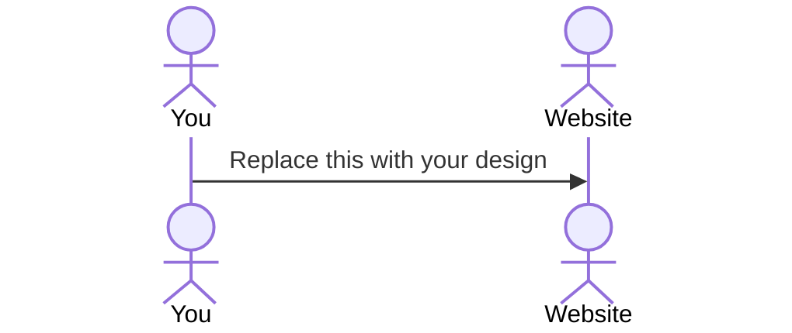

# Your startup name here

[My Notes](notes.md)

This application will act as a chess timer for multiple different people who are playing board games and will prompt the person whose turn it is to 

> [!NOTE]
> This is a template for your startup application. You must modify this `README.md` file for each phase of your development. You only need to fill in the section for each deliverable when that deliverable is submitted in Canvas. Without completing the section for a deliverable, the TA will not know what to look for when grading your submission. Feel free to add additional information to each deliverable description, but make sure you at least have the list of rubric items and a description of what you did for each item.

> [!NOTE]
> If you are not familiar with Markdown then you should review the [documentation](https://docs.github.com/en/get-started/writing-on-github/getting-started-with-writing-and-formatting-on-github/basic-writing-and-formatting-syntax) before continuing.

## 🚀 Specification Deliverable

> [!NOTE]
> Fill in this sections as the submission artifact for this deliverable. You can refer to this [example](https://github.com/webprogramming260/startup-example/blob/main/README.md) for inspiration.

For this deliverable I did the following. I checked the box `[x]` and added a description for things I completed.

- [X] Proper use of Markdown
- [X] A concise and compelling elevator pitch
- [X] Description of key features
- [X] Description of how you will use each technology
- [X] One or more rough sketches of your application. Images must be embedded in this file using Markdown image references.

### Elevator pitch

Have you ever sat down for a game of Catan with a friend who takes way too long to take their turn? Or gotten so engrossed in a conversation that the entire table forgets whose turn it is? The BGTimer Application allows you to not only set a time limit for those who think just a _little_ too long but also allows you to keep track of whose turn it is. It can also prompt those who might not be paying attention to take their turns! With this app, board game nights can progress without a cinch!

### Design

Lorem ipsum dolor sit amet, consectetur adipiscing elit, sed do eiusmod tempor incididunt ut labore et dolore magna aliqua. Ut enim ad minim veniam, quis nostrud exercitation ullamco laboris nisi ut aliquip ex ea commodo consequat. Duis aute irure dolor in reprehenderit in voluptate velit esse cillum dolore eu fugiat nulla pariatur. Excepteur sint occaecat cupidatat non proident, sunt in culpa qui officia deserunt mollit anim id est laborum.

### Key features

- Login via HTTPS
- Select game to play
- Display of current players in the game
- Ability to change time allowed to each player
- Ability to display and change turn order
- Round tracker
- Ability to invite multiple people to a single game
- Ability for host to pause game
- Ability to randomly select a starting player

### Technologies

I am going to use the required technologies in the following ways.

- **HTML** - Utilizes correct HTML structure for application. Page for login, and one for joining a game. Two in total
- **CSS** - Application styling to look good on both mobile and desktop, clear styling to prioritize UI elements
- **React** - Change display to game component, displays whose turn it is, displays how much time a user has left
- **Service** - Backend service with endpoints for:
  - login
  - retrieving turn order
  - submitting turn conclusions
  - retrieving round number
- **DB/Login** - Store users in database. Register and login users. Cannot join a game unless authenticated.
- **WebSocket** - Whenever a user passes their turn, all users are notified of whose turn it is

## 🚀 AWS deliverable

For this deliverable I did the following. I checked the box `[x]` and added a description for things I completed.

- [X] **Server deployed and accessible with custom domain name** - [My server link](https://bgtimer.click).

## 🚀 HTML deliverable

For this deliverable I did the following. I checked the box `[x]` and added a description for things I completed.

- [X] **HTML pages** - I added 3 HTML pages to simulate the functionality of my website
- [X] **Proper HTML element usage** - All tables and images worked as intended, all buttons work as currently intended.
- [X] **Links** - I added navigation links at the top of the website and added my GitHub Repository link to the bottom of each HTML page.
- [X] **Text** - I added several tables that will hold player data later, as well as adding an entire section featuring a particular game.
- [X] **3rd party API placeholder** - 3rd party API will fetch information on a specific game and display it on the login screen.
- [X] **Images** - I added a cover of Spirit Island to the Login page as part of a placeholder 3rd party API call. Dynamic images may or may not be a part of the final product. Also added a custom tab image. 
- [X] **Login placeholder** - Login and Register buttons currently send those who click on it to the Join screen, password field uses standard password "dots" to hide password.
- [X] **DB data placeholder** - The database will store games currently in progress as well as the players currently playing it.
- [X] **WebSocket placeholder** - Websocket will notify players when it is their turn and will notify the players in the game when someone passes their turn or runs out of time.

## 🚀 CSS deliverable

For this deliverable I did the following. I checked the box `[x]` and added a description for things I completed.

- [X] **Visually appealing colors and layout. No overflowing elements.** - The color scheme is primarily bg-light and bg-body, and there are no overflowing elements visible on the website
- [X] **Use of a CSS framework** - The styling of the website makes HEAVY use of bootstrap
- [X] **All visual elements styled using CSS** - Most elements are styled using Bootstrap classes with styling done using raw CSS as needed
- [X] **Responsive to window resizing using flexbox and/or grid display** Flexbox is used heavily throughout the website
- [X] **Use of a imported font** - On the game section the Game: Terraforming Mars placeholder text is in Roboto imported from Google.
- [X] **Use of different types of selectors including element, class, ID, and pseudo selectors** - Element, class, and ID selectors are used heavily throughout the CSS files
## 🚀 React part 1: Routing deliverable

For this deliverable I did the following. I checked the box `[x]` and added a description for things I completed.

- [ ] **Bundled using Vite** - I did not complete this part of the deliverable.
- [ ] **Components** - I did not complete this part of the deliverable.
- [ ] **Router** - I did not complete this part of the deliverable.

## 🚀 React part 2: Reactivity deliverable

For this deliverable I did the following. I checked the box `[x]` and added a description for things I completed.

- [ ] **All functionality implemented or mocked out** - I did not complete this part of the deliverable.
- [ ] **Hooks** - I did not complete this part of the deliverable.

## 🚀 Service deliverable

For this deliverable I did the following. I checked the box `[x]` and added a description for things I completed.

- [ ] **Node.js/Express HTTP service** - I did not complete this part of the deliverable.
- [ ] **Static middleware for frontend** - I did not complete this part of the deliverable.
- [ ] **Calls to third party endpoints** - I did not complete this part of the deliverable.
- [ ] **Backend service endpoints** - I did not complete this part of the deliverable.
- [ ] **Frontend calls service endpoints** - I did not complete this part of the deliverable.
- [ ] **Supports registration, login, logout, and restricted endpoint** - I did not complete this part of the deliverable.

## 🚀 DB deliverable

For this deliverable I did the following. I checked the box `[x]` and added a description for things I completed.

- [ ] **Stores data in MongoDB** - I did not complete this part of the deliverable.
- [ ] **Stores credentials in MongoDB** - I did not complete this part of the deliverable.

## 🚀 WebSocket deliverable

For this deliverable I did the following. I checked the box `[x]` and added a description for things I completed.

- [ ] **Backend listens for WebSocket connection** - I did not complete this part of the deliverable.
- [ ] **Frontend makes WebSocket connection** - I did not complete this part of the deliverable.
- [ ] **Data sent over WebSocket connection** - I did not complete this part of the deliverable.
- [ ] **WebSocket data displayed** - I did not complete this part of the deliverable.
- [ ] **Application is fully functional** - I did not complete this part of the deliverable.
